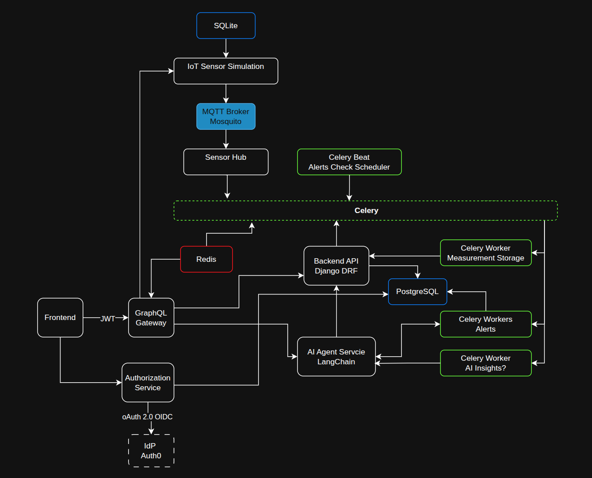

# Cardio Trace Platform

Cardio Trace Platform is a prototype IoT platform demonstrating heart rate monitoring, HRV analysis, and AI integration. It showcases multi-tenant architecture, asynchronous processing, and simulated sensor data flows.



## Purpose

- Define the overall system architecture for Cardio Trace IoT platform.
- Document design decisions, technologies, and data flow.
- Serve as the source of truth for all platform components and services.
- Provide diagrams and guidance for implementing, integrating, and extending the platform.

## Related Repositories

The platform consists of multiple service repositories:

- [cardio-trace-iot-platform](https://github.com/KrystianTelizyn/cardio-trace-platform) - main meta repository with system documentation. You are here.
- [cardio-trace-iot-simulation](https://github.com/KrystianTelizyn/cardio-trace-iot-simulation) – collects and validates data from heart rate sensors (MQTT).
- `cardio-trace-sensor-hub` – collects and validates data from heart rate sensors (MQTT).
- `cardio-trace-backend-api` – core domain logic and data management.
- `cardio-trace-workers` – async processing, alerts, and AI tasks.
- `cardio-trace-ai-service` – AI insights, analysis, and chat functionality.
- `cardio-trace-graphql-gateway` – GraphQL API for frontend applications.
- `cardio-trace-frontend` – web interface for monitoring and visualization.
- `cardio-trace-auth-service` – Auth0 integration for user authentication.
- `cardio-trace-deployment` – deployment configurations and scripts.

## Repository Structure

```bash
cardio-trace-platform
│
├─ docs/
│   ├─ adr/                 # Architecture Decision Records
│   │   └─ README.md
│   ├─ diagrams/            # System, data flow, deployment diagrams
│   │   └─ system-overview.drawio
│   └─ architecture.md      # System architecture description
│
├─ scripts/                 # Dev tools, helpers, analysis scripts (optional)
│
└─ README.md
```

## Getting Started

1. Review the **architecture overview** in `docs/architecture.md`.
2. Familiarize yourself with **ADRs** in `docs/adr/`.
3. Refer to **related service repositories** for implementation details.
4. Deployment instructions and environment setup are located in the `cardio-trace-deployment` repository.

## Contributing

- All architecture-related decisions must be documented in `docs/adr/`.
- Suggestions for architecture improvements, new diagrams, or ADRs are welcome via pull requests.
- Follow consistent naming and documentation conventions.

## Contact

Cardio Trace Platform is maintained by Krystian Teliżyn.  
For detailed information, refer to the documentation and ADRs.
